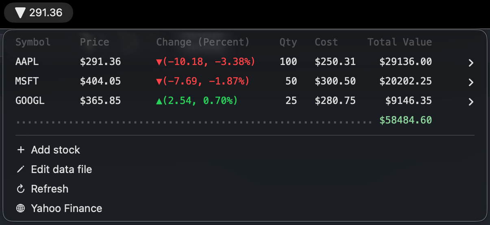

# Stock Portfolio

A [SwiftBar](https://github.com/swiftbar/SwiftBar)/[xbar](https://github.com/matryer/xbar) plugin written in Python that displays your stock portfolio directly in the macOS menu bar using real-time data from Yahoo Finance.


## Features

- **Menu bar ticker** — shows the price and a live up/down arrow for your primary stock at a glance
- **Portfolio dropdown** — a formatted table with symbol, current price, change (value + percent), quantity held, cost basis, and current total value for every position
- **Color-coded changes** — green (▲) for gains, red (▼) for losses using ANSI colors
- **Portfolio total** — running total of your entire portfolio's current market value
- **Yahoo Finance links** — click any row to open that stock's Yahoo Finance page in a built-in webview
- **Add / Edit / Delete from the menu** — manage your portfolio directly from the dropdown using native macOS dialogs; no code editing required
- **Edit data file** — open `~/.stock_portfolio.txt` directly for bulk edits
- **Empty portfolio guidance** — shows a warning and instructions when no stocks have been added yet
- **Auto-refresh** — data refreshes every 5 minutes automatically
- **Manual refresh** — a Refresh menu item lets you force an immediate update

## Preview



## Requirements

| Requirement | Version |
|---|---|
| macOS | 12 Monterey or later |
| SwiftBar/xbar | [Latest release](https://github.com/swiftbar/SwiftBar/releases)/[Latest release](https://github.com/matryer/xbar/releases) |
| Python | 3.x |
| yfinance | Latest |

## Installation

### 1. Install SwiftBar/xbar

Download and install SwiftBar from the [official releases page](https://github.com/swiftbar/SwiftBar/releases) or via Homebrew:

```bash
brew install swiftbar
```

Or install xbar from its official [website](https://xbarapp.com/).

### 2. Install the Python dependency

```bash
pip3 install yfinance
```

### 3. Add the plugin

Copy `stock_portfolio.5m.py` to your SwiftBar plugins directory (configured when you first launch SwiftBar) and make it executable:

```bash
cp stock_portfolio.5m.py ~/path/to/swiftbar-plugins/
chmod +x ~/path/to/swiftbar-plugins/stock_portfolio.5m.py
```

SwiftBar will detect the new plugin automatically. If it doesn't appear right away, use **SwiftBar → Refresh All** from the menu bar.

## Configuration

### Managing your portfolio

Portfolio data is stored in `~/.stock_portfolio.txt`. You manage it directly from the SwiftBar dropdown — no code editing required.

| Action | How |
|---|---|
| **Add a stock** | Click **Add stock** in the dropdown. Three macOS dialogs will prompt you for the symbol, quantity, and cost per share. |
| **Edit a stock** | Expand any stock row and click **Edit \<SYMBOL\>**. The same dialog flow pre-fills current values. |
| **Delete a stock** | Expand any stock row and click **Delete \<SYMBOL\>**, or use the **Delete stock** submenu to pick from all positions. |
| **Bulk edit** | Click **Edit data file** to open `~/.stock_portfolio.txt` in your default text editor. |

### Data file format

`~/.stock_portfolio.txt` is a plain CSV file — one position per line:

```text
SYMBOL,quantity,cost_per_share
```

Example:

```text
AAPL,100,250.31
MSFT,50,300.50
GOOGL,25,280.75
```

| Field | Description |
|---|---|
| `SYMBOL` | Stock symbol as listed on Yahoo Finance (e.g. `AAPL`, `TSLA`, `BTC-USD`) |
| `quantity` | Number of shares (or units) you hold (integer) |
| `cost_per_share` | Your average cost basis per share in USD (decimal) |

> **Note:** The **first** symbol in the file is the one displayed in the menu bar. Reorder the lines to change which ticker is shown at a glance.

### Changing the refresh interval

The filename encodes the refresh interval. Rename the file to change how often the data updates:

| Filename | Refresh interval |
|---|---|
| `stock_portfolio.1m.py` | Every 1 minute |
| `stock_portfolio.5m.py` | Every 5 minutes (default) |
| `stock_portfolio.15m.py` | Every 15 minutes |
| `stock_portfolio.1h.py` | Every 1 hour |

See the [SwiftBar documentation](https://github.com/swiftbar/SwiftBar#plugin-naming) for the full naming convention.

## How It Works

1. On each refresh cycle SwiftBar executes the Python script.
2. The script reads `~/.stock_portfolio.txt` to load the portfolio. If the file does not exist, an empty-portfolio screen is shown with an **Add stock** prompt.
3. `yfinance.Tickers()` is called once with all symbols to minimize API requests.
4. The first line printed (price + directional arrow SF Symbol for the first stock) becomes the menu bar title.
5. Lines after `---` populate the dropdown, formatted as a fixed-width table with ANSI color support.
6. Each stock row carries a `href` to its Yahoo Finance page and opens in SwiftBar's built-in webview. Expanding a row reveals **View on Yahoo Finance**, **Edit**, and **Delete** actions.
7. Add, edit, and delete operations use `osascript` to present native macOS dialogs, then write the updated data back to `~/.stock_portfolio.txt` and trigger a plugin refresh.

## Troubleshooting

### Plugin does not appear in the menu bar

- Confirm the file is executable: `chmod +x stock_portfolio.5m.py`
- Check that the shebang line (`#!/usr/bin/env python3`) resolves to a valid Python 3 installation: `which python3`

### `ModuleNotFoundError: No module named 'yfinance'`

- The shebang must use the same Python that has `yfinance` installed. Find the correct path with `which python3` and update the first line of the script accordingly, or install into that interpreter: `pip3 install yfinance`

### Prices show `N/A`

- Yahoo Finance occasionally returns incomplete data. The plugin will display updated values on the next refresh cycle. Check that the ticker symbols are valid on [finance.yahoo.com](https://finance.yahoo.com).

### Colors not showing

- Ensure the `ansi=true` parameter is present on each printed row (it is included by default). SwiftBar 1.4+ supports ANSI colors natively.

## License

MIT License. See [LICENSE](LICENSE) for details.

## Author

**Carlos E. Torres** — [@cetorres](https://github.com/cetorres)
